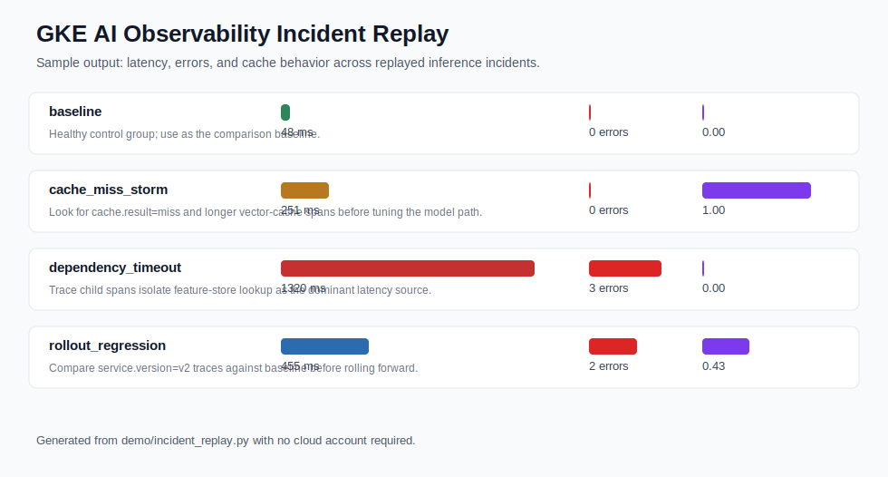

# GKE AI Inference Reliability Lab

A production-oriented Kubernetes observability and reliability lab for AI
inference workloads using OpenTelemetry.

The goal is practical: show how a platform/SRE team can replay inference
incidents, validate SLO-style reliability gates, wire Kubernetes metadata, and
keep collector delivery durable before an AI service reaches production.
The second-stage goal is to make the lab look credible from code review, not
only from prose: the repo now includes multi-window burn-rate analysis, canary
rollback decisions, OTLP trace-quality auditing, collector outage modeling,
incident correlation, critical-path attribution, evidence coverage checks,
HPA lag modeling, tenant blast-radius detection, and token/GPU cost guardrails.
It also includes supply-chain, CI workflow governance, repository governance,
developer runtime governance, Kubernetes hardening, Kubernetes API
compatibility, and admission-policy evidence so reviewers can see how
deployment drift would be blocked before a bad manifest reaches a cluster.
OSS license evidence checks Apache-2.0, NOTICE coverage, README license links,
approved GitHub Actions, approved container images, and third-party reference
inventory before the repo is treated as publicly reusable.
Secret hygiene evidence scans committed source, manifests, documentation, and
generated evidence for high-confidence key, token, webhook, and private-key
formats before release readiness is reported.
SBOM inventory evidence generates a CycloneDX-style component list for GitHub
Actions, container images, and runtime tools so reviewers can trace third-party
references back to source files.
Security response evidence checks private vulnerability reporting, severity
triage SLAs, fix/regression expectations, and coordinated disclosure updates
before release readiness is reported.
Namespace resource governance evidence checks that telemetry and workload
namespaces have ResourceQuota and LimitRange controls that cover current
requests and limits with headroom.
Availability topology evidence checks that disruption budgets, replica floors,
and topology spread constraints are explicit for the collector and sample
inference workload.
Autoscaling policy evidence checks that the sample inference workload has an
actual HPA with bounded replicas, CPU/memory metrics, request alignment, and
scale-up/scale-down behavior.
Scheduling placement evidence checks that telemetry and inference workloads
use non-preempting PriorityClasses, soft GKE node-pool affinity, and bounded
tolerations without hard node selectors that would break local smoke tests.
Network boundary evidence checks that workload egress is bounded to telemetry
and DNS while collector ingress remains scoped to workload namespaces.
Collector self-observability evidence checks that the collector scrapes its
own internal metrics on loopback and sends those metrics through the same
queued exporter path as workload telemetry.
Telemetry exporter authority evidence checks that the collector explicitly
declares the upstream gateway as authoritative, keeps local debug export as a
bounded companion path, and preserves file-backed queue/retry delivery.
Telemetry sampling evidence checks that collector tail sampling keeps critical
error, dependency-timeout, rollout-regression, and collector-pressure traces
while bounding healthy baseline trace volume.
Workload Identity evidence checks that GKE service account binding, service
account token mounting, RBAC scope, static credential handling, and upstream
exporter transport are explicit before the manifests are treated as deployment
evidence.
Kubernetes API compatibility evidence checks stable API versions, optional CRD
skip paths, kind smoke apply order, and admissionregistration.k8s.io/v1
fail-closed behavior before release readiness is reported.
Private-cluster admission boundary evidence checks that private GKE clusters
use native admission policy controls without an admission webhook firewall
dependency, while optional operator-backed CRDs stay behind explicit API
resource probes and skip paths.
Release waiver governance is included so manual exceptions stay bounded,
approved, time-limited, and linked back to rollback and RCA evidence.
Disaster recovery drill evidence verifies that critical release artifacts can
be restored with matching checksums inside the recovery objective.
Observability drift audit evidence checks that alerting rules, Grafana
dashboards, OpenSLO contracts, and runbooks continue to describe the same
scenario set and response contract.
Incident response drill evidence checks that alert routes, runbook owners,
acknowledgement SLAs, escalation, rollback drills, and post-incident reviews
form an executable on-call path.
Dependency contract evidence checks that vector cache, feature store, model
runtime, and telemetry exporter failures have owners, timeout/retry/fallback
controls, alert routes, and release actions.
Synthetic probe evidence checks that preflight probes cover healthy baseline,
dependency failure, canary regression, and telemetry-delivery paths before
release promotion.
Model release safety evidence checks that a model-version rollout is tied to
artifact pinning, offline eval thresholds, schema compatibility, canary
signals, token/GPU cost deltas, rollback evidence, and trace labels.
Staged telemetry validation evidence checks that rollout, trace quality,
redaction, cost, exporter authority, synthetic probes, and model-release
blocking are all validated before a staged rollout can expand.
Shadow traffic replay evidence checks that candidate inference traffic stays
isolated from users, disables writes and side effects, avoids prompt/response
storage, and is compared against rollout, cost, probe, and model-release gates.
Accelerator quota fairness evidence checks that GPU/accelerator use stays
bounded by tenant tier, over-quota candidates are blocked or reviewed, and
best-effort traffic is shed before premium or standard capacity is affected.
Load-shedding policy evidence checks that overload and incident paths protect
high-priority tenants, shed best-effort traffic first, use fallback behavior,
and link cost, capacity, runbook, probe, and release-action evidence.
Regional failover evidence checks that zone or region failure decisions are
connected to DR RTO/RPO, standby capacity, synthetic probes, load shedding,
rollback, runbook ownership, and Kubernetes control-plane hardening.
Release control ownership evidence checks that every release-readiness check
has an owner, severity tier, review cadence, escalation path, rollback action,
and evidence path.
Control traceability evidence checks that each configured release-readiness
control links back to committed evidence, source code, policy/config inputs,
and tests.
Replay source contract evidence checks that generated incident summaries and
OTLP payloads preserve the expected scenarios, span shape, root attributes,
model/tenant/version metadata, and incident signals before downstream gates
consume them.
Evidence pipeline audit evidence checks that generated artifacts are produced
before downstream consumers read them, preventing stale committed evidence from
silently satisfying later release gates.
Evidence schema audit evidence checks that critical generated JSON reports keep
stable status fields, required fields, required checks, metric contracts, array
shapes, and negative drift fixtures before release readiness is reported.
Validation contract evidence checks that CI/local validation covers generated
evidence scripts, Python compile coverage, policy JSON files, committed
evidence JSON files, required validation commands, and release-readiness
arguments before a proof packet is trusted.
Documentation link integrity evidence checks README, contributor docs, release
docs, and committed evidence indexes for local path, anchor, image, and scheme
drift before public review links are trusted.
Public claim evidence audit checks that README and industry-map claims stay
backed by committed JSON/Markdown evidence, release-readiness checks, and
explicit boundary language before public review text is trusted.
Release notes contract evidence checks that release notes and contribution
guidance name the changed capability, evidence artifacts, validation commands,
and deployment boundaries before a release packet is trusted.
Proof packet integrity evidence re-checks the provenance manifest against the
current repository tree so stale evidence, source drift, missing artifacts, and
circular release-proof inputs block release readiness.

This repository is a personal reference project. Related upstream Google Cloud
OpenTelemetry sample PRs are tracked in
[docs/google-oss-upstream.md](docs/google-oss-upstream.md), but pending PRs are
not described as merged.



## What This Demonstrates

- A zero-cost local incident replay with no Python dependencies.
- A replay source contract audit that verifies the replay summary and OTLP
  payloads keep scenario coverage, span shape, root attributes, and incident
  metadata intact before downstream gates consume them.
- AI inference scenarios for baseline traffic, cache-miss latency, dependency
  timeout, rollout regression, and collector queue pressure.
- Configurable SLO-style reliability gates that verify the healthy baseline
  and classify failure scenarios by the production signal an SRE would need.
- Capacity-planning evidence that separates scaling problems from reliability
  incidents.
- Generated runbooks for first-response debugging.
- Advanced reliability controls for burn-rate paging, canary rollback, trace
  quality, collector outage resilience, and alert deduplication.
- Detailed inference controls for critical-path attribution, sampling evidence
  coverage, HPA lag, tenant blast radius, and token/GPU cost guardrails.
- A policy-as-code deployment decision that combines SLO, burn-rate, rollout,
  trace, collector, autoscaling, tenant, and cost signals into one promotion
  gate.
- Policy regression fixtures that prove promote, block, and manual-review
  decisions stay stable across release-risk scenarios.
- A supply-chain audit that verifies Kubernetes image references are
  digest-pinned, non-floating, explicitly pulled, and owner-labeled.
- An OSS license audit that verifies Apache-2.0, NOTICE, README license links,
  approved GitHub Actions, approved container images, and third-party reference
  inventory.
- A secret hygiene audit that scans source, manifests, docs, and generated
  evidence for high-confidence credential formats and proves negative fixtures.
- A SBOM inventory audit that generates a CycloneDX-style third-party component
  list and verifies source traceability for Actions, images, and runtimes.
- A security response audit that verifies private reporting, severity triage
  SLAs, fix evidence expectations, disclosure updates, and negative fixtures.
- A CI governance audit that verifies GitHub Actions use maintained action
  runtime versions, least-privilege permissions, concurrency cancellation,
  bounded execution, and the real validation command.
- A repository governance audit that verifies contribution instructions,
  security reporting, CODEOWNERS coverage, release process evidence, and
  project boundaries.
- A developer runtime audit that verifies Make targets, Python version
  pinning, zero-dependency validation, optional tool documentation, and local
  output boundaries.
- Kubernetes manifest hardening evidence for probes, resource budgets,
  restricted collector security context, disruption protection, and
  NetworkPolicy boundaries.
- A Pod Security Admission audit that verifies both namespaces enforce the
  restricted profile and that workloads remain compatible with restricted pod,
  container, and volume rules.
- A Kubernetes API compatibility audit that verifies core manifests use stable
  API versions, optional OpenTelemetry and Prometheus CRDs stay behind kind
  smoke probes and skip paths, and admission policy stays on the v1 fail-closed
  API surface.
- A namespace resource governance audit that verifies ResourceQuota,
  LimitRange defaulting, quota headroom against current Deployments, and
  namespace ownership labels.
- An availability topology audit that verifies replica floors, PDB coverage,
  topology spread constraints, selector alignment, and owner labels.
- An autoscaling policy audit that verifies the sample inference HPA target,
  min/max bounds, CPU/memory metrics, metric requests, scale behavior, and
  owner labels.
- A scheduling placement audit that verifies non-preempting PriorityClasses,
  workload priority binding, preferred node affinity, bounded tolerations, and
  portable scheduling preferences.
- A rollout safety audit that verifies Deployment strategy, surge/unavailable
  settings, rollout timing, termination drain windows, PDB alignment, and
  PVC-backed collector rollout behavior.
- A config rollout audit that verifies collector ConfigMap checksum rollout
  binding, config path alignment, read-only mounts, owner labels, and secret
  marker hygiene.
- A network boundary audit that verifies workload egress to telemetry and DNS,
  collector ingress from workload namespaces, and absence of allow-all egress.
- A collector self-observability audit that verifies loopback scraping of
  collector internal metrics, metrics pipeline wiring, queued export, retry,
  and negative drift fixtures.
- A telemetry exporter authority audit that verifies traces and metrics have
  an explicit authoritative upstream gateway, local debug export is not the
  only release path, and queued retry delivery remains enabled.
- A telemetry sampling audit that verifies OpenTelemetry tail-sampling policy,
  critical incident trace retention, bounded baseline sampling, trace pipeline
  processor order, and negative drift fixtures.
- A Workload Identity audit that verifies GKE service account annotation,
  service account token boundaries, read-only RBAC scope, static credential
  rejection, and TLS upstream exporter configuration.
- A Kubernetes admission policy pack and simulated admission audit that allow
  the committed deployments while denying drift fixtures for unpinned images,
  privileged containers, missing probes/resources, bad registries, and missing
  OpenTelemetry instrumentation.
- Generated SLO alerting rules that connect latency, dependency, rollout,
  cache, and telemetry-loss signals to severities, runbooks, and dashboard
  hints.
- A generated Grafana dashboard and ConfigMap that cover every replayed SLO
  scenario with Prometheus queries and runbook links.
- An OpenSLO-style SLO contract that ties the service objective to Prometheus
  SLI queries, telemetry-quality evidence, alerting, dashboard, release gate,
  and runbooks.
- An observability drift audit that compares alerting rules, dashboard
  scenario coverage, OpenSLO links, runbook coverage, and negative drift
  fixtures before the release-readiness gate passes.
- A telemetry redaction audit that proves trace payloads keep safe AI metadata
  while blocking prompt text, response bodies, secrets, and direct identifiers.
- A telemetry cost budget that estimates sampled trace ingest and retained
  storage from generated OTLP payload size and span volume.
- An error-budget ledger that maps replayed incidents to allowed bad events,
  consumed budget, release actions, and rollback/manual-review decisions.
- A rollback drill that turns the release gate, error budget, and runbooks into
  named-owner incident timelines with RTO/RPO checks.
- A post-incident review packet that links impact, root cause, timeline,
  corrective actions, and preventive controls back to generated evidence.
- An incident response drill that verifies page/ticket routes, on-call
  acknowledgement SLAs, escalation stages, owners, rollback evidence, and RCA
  evidence for each replayed alert scenario.
- A dependency contract audit that links critical AI inference dependencies to
  owners, timeout/retry/fallback controls, trace attributes, alerts, runbooks,
  error-budget decisions, and rollback/manual-review actions.
- A synthetic probe audit that verifies preflight probes for baseline,
  dependency, canary, and telemetry-delivery paths before release promotion.
- A model release safety audit that links model artifact pinning, offline eval
  thresholds, schema compatibility, canary rollback signals, token/GPU cost
  deltas, rollback target evidence, and trace labels before promotion.
- A shadow traffic replay audit that checks isolated candidate traffic,
  no-user-serving guarantees, disabled writes/side effects, privacy-safe
  telemetry, rollout comparison, cost review, and rollback/probe linkage.
- An accelerator quota fairness audit that checks tenant-tier GPU/accelerator
  budgets, candidate quota review, premium/standard protection, best-effort
  shedding, shadow traffic blocking, and model release linkage.
- A load-shedding policy audit that ties capacity warnings, tenant blast
  radius, token/GPU cost review, graceful degradation, preflight probes,
  runbook ownership, and error-budget release actions into one gate.
- A regional failover audit that checks standby-region coverage, DR/RTO/RPO,
  capacity guardrails, traffic-safety linkage, rollback, and Kubernetes
  control-plane readiness for failover decisions.
- Release waiver governance that conditionally approves bounded manual-review
  exceptions while denying production-promotion overrides for budget-exhausted
  incidents.
- A release control ownership audit that assigns owner groups, severity tiers,
  review cadence, escalation, rollback action, and evidence paths to release
  checks.
- A control traceability audit that links configured release-readiness controls to
  committed evidence, generator code, policy/config inputs, and tests.
- A disaster recovery drill that restores critical release evidence,
  Kubernetes/Grafana/OpenSLO artifacts, admission policy, and source policy
  files with SHA-256 verification inside the configured RTO/RPO.
- An evidence pipeline audit that verifies generated evidence producer steps
  run before their consumers, including DR before regional failover and
  rendered evidence indexes before provenance manifests.
- An evidence schema audit that verifies generated JSON reports keep required
  fields, check shapes, metric contracts, allowed values, and negative drift
  fixtures stable.
- A validation contract audit that verifies generated evidence scripts,
  Python compile coverage, policy JSON checks, committed evidence JSON checks,
  required validation commands, and release-readiness arguments stay
  synchronized.
- A documentation link integrity audit that verifies README, docs, evidence
  indexes, anchors, images, and allowed schemes before public review links are
  trusted.
- A public claim evidence audit that verifies README and industry-map claims
  stay backed by committed evidence, release-readiness checks, and explicit
  project boundary language.
- A release notes contract audit that verifies release-note fields, release
  packet evidence references, validation command names, deployment boundaries,
  and contribution summary requirements before release readiness passes.
- An evidence provenance manifest with SHA-256 checksums for generated
  evidence, Kubernetes/Grafana/OpenSLO artifacts, and source inputs.
- A proof packet integrity audit that re-checks provenance checksums against
  the current tree and blocks release readiness on stale, missing, or circular
  proof inputs.
- A release-readiness report that checks committed evidence coverage.
- A generated incident report that turns raw telemetry into a reviewer-friendly
  debugging narrative.
- Committed evidence artifacts so reviewers can inspect the replay result
  without running the lab first.
- A GKE/Kubernetes collector layout with resource context and durable queue
  storage.
- Cross-namespace OpenTelemetry auto-instrumentation references.
- A concise production checklist for SRE/platform review.
- A case study that connects the work to real incident-debugging needs.
- Optional Docker Compose wiring for OpenTelemetry Collector and Jaeger.
- Optional kind smoke test that applies the Kubernetes manifests, port-forwards
  the collector, replays incidents, and runs the reliability gate.

## Quick Start

Validate the repo:

```bash
make validate
```

Regenerate evidence and run the CI-mode stability gate:

```bash
make evidence
make ci
```

Run the local demo:

```bash
./scripts/run-local-demo.sh
```

This replays five AI inference incidents, sends OTLP/HTTP traces, and writes:

```text
out/incident-replay/report.md
out/incident-replay/summary.json
```

Run the reliability gate against the generated replay:

```bash
python3 demo/reliability_gate.py \
  --summary out/incident-replay/summary.json \
  --slo-config config/reliability-slo.json \
  --output-dir out/reliability-gate
```

Generate capacity and runbook evidence:

```bash
python3 demo/capacity_planner.py \
  --summary out/incident-replay/summary.json \
  --slo-config config/reliability-slo.json \
  --output-dir out/capacity-plan

python3 demo/runbook_generator.py \
  --summary out/incident-replay/summary.json \
  --gate out/reliability-gate/reliability-gate.json \
  --output-dir out/incident-runbooks
```

Run the advanced reliability controls:

```bash
python3 demo/incident_replay.py \
  --no-send \
  --output-dir out/incident-replay \
  --payload-dir out/incident-replay-payloads

python3 demo/advanced_reliability.py \
  --summary out/incident-replay/summary.json \
  --payload-dir out/incident-replay-payloads \
  --slo-config config/reliability-slo.json \
  --advanced-config config/advanced-reliability.json \
  --output-dir out/advanced-reliability
```

Run the detailed reliability controls:

```bash
python3 demo/detailed_reliability.py \
  --summary out/incident-replay/summary.json \
  --payload-dir out/incident-replay-payloads \
  --detailed-config config/detailed-reliability.json \
  --output-dir out/detailed-reliability
```

When the Docker daemon is available, the local demo starts an OpenTelemetry
Collector container, sends the replayed traces, prints the collector debug
output, and then cleans up the container. If Docker is not running, it falls
back to a tiny Python OTLP debug receiver so the trace flow is still runnable
without Docker Compose, `kind`, or a cloud account.

## Optional Jaeger UI

For a local trace UI:

```bash
docker compose up -d
python3 demo/incident_replay.py
open http://localhost:16686
```

Search for `toy-ai-inference-api` in Jaeger, then compare the baseline,
cache-miss, dependency-timeout, rollout-regression, and collector-pressure
traces.

## Evidence

The repository includes committed sample evidence generated by the same replay
script:


- [Sample incident report](docs/evidence/sample-incident-report.md)
- [Sample summary JSON](docs/evidence/sample-summary.json)
- [Reliability gate report](docs/evidence/reliability-gate.md)
- [Reliability gate JSON](docs/evidence/reliability-gate.json)
- [Capacity plan](docs/evidence/capacity-plan.md)
- [Incident runbooks](docs/evidence/incident-runbooks.md)
- [Burn rate analysis](docs/evidence/burn-rate-analysis.md)
- [Rollout guard](docs/evidence/rollout-guard.md)
- [Trace quality audit](docs/evidence/trace-quality-audit.md)
- [Collector resilience model](docs/evidence/collector-resilience.md)
- [Incident correlation](docs/evidence/incident-correlation.md)
- [Complex problem coverage](docs/evidence/complex-problems.md)
- [Critical path attribution](docs/evidence/critical-path-attribution.md)
- [Evidence coverage](docs/evidence/evidence-coverage.md)
- [HPA lag analysis](docs/evidence/hpa-lag-analysis.md)
- [Tenant blast radius](docs/evidence/tenant-blast-radius.md)
- [Token cost guard](docs/evidence/token-cost-guard.md)
- [Detailed problem coverage](docs/evidence/detailed-problems.md)
- [Deployment policy decision](docs/evidence/deployment-policy.md)
- [Policy regression suite](docs/evidence/policy-regression-suite.md)
- [Supply chain audit](docs/evidence/supply-chain-audit.md)
- [OSS license audit](docs/evidence/oss-license-audit.md)
- [Secret hygiene audit](docs/evidence/secret-hygiene-audit.md)
- [SBOM inventory audit](docs/evidence/sbom-inventory-audit.md)
- [Security response audit](docs/evidence/security-response-audit.md)
- [CI governance audit](docs/evidence/ci-governance-audit.md)
- [Repository governance audit](docs/evidence/repository-governance-audit.md)
- [Developer runtime audit](docs/evidence/developer-runtime-audit.md)
- [Kubernetes manifest hardening audit](docs/evidence/k8s-hardening-audit.md)
- [Pod Security Admission audit](docs/evidence/pod-security-admission-audit.md)
- [Kubernetes API compatibility audit](docs/evidence/kubernetes-api-compatibility-audit.md)
- [Private cluster admission boundary audit](docs/evidence/private-cluster-admission-boundary-audit.md)
- [Namespace resource audit](docs/evidence/namespace-resource-audit.md)
- [Availability topology audit](docs/evidence/availability-topology-audit.md)
- [Autoscaling policy audit](docs/evidence/autoscaling-policy-audit.md)
- [Scheduling placement audit](docs/evidence/scheduling-placement-audit.md)
- [Rollout safety audit](docs/evidence/rollout-safety-audit.md)
- [Config rollout audit](docs/evidence/config-rollout-audit.md)
- [Network boundary audit](docs/evidence/network-boundary-audit.md)
- [Collector self-observability audit](docs/evidence/collector-self-observability-audit.md)
- [Telemetry exporter authority audit](docs/evidence/telemetry-exporter-authority-audit.md)
- [Telemetry sampling audit](docs/evidence/telemetry-sampling-audit.md)
- [Workload Identity audit](docs/evidence/workload-identity-audit.md)
- [Admission policy audit](docs/evidence/admission-policy-audit.md)
- [SLO alerting rules](docs/evidence/alerting-rules.md)
- [Grafana dashboard evidence](docs/evidence/grafana-dashboard.md)
- [OpenSLO contract evidence](docs/evidence/openslo-contract.md)
- [Observability drift audit](docs/evidence/observability-drift-audit.md)
- [Telemetry redaction audit](docs/evidence/telemetry-redaction-audit.md)
- [Telemetry cost budget](docs/evidence/telemetry-cost-budget.md)
- [Error budget ledger](docs/evidence/error-budget-ledger.md)
- [Rollback drill](docs/evidence/rollback-drill.md)
- [Post-incident review](docs/evidence/post-incident-review.md)
- [Incident response drill](docs/evidence/incident-response-drill.md)
- [Dependency contract audit](docs/evidence/dependency-contract-audit.md)
- [Synthetic probe audit](docs/evidence/synthetic-probe-audit.md)
- [Model release safety audit](docs/evidence/model-release-safety-audit.md)
- [Staged telemetry validation audit](docs/evidence/staged-telemetry-validation-audit.md)
- [Shadow traffic replay audit](docs/evidence/shadow-traffic-replay-audit.md)
- [Accelerator quota fairness audit](docs/evidence/accelerator-quota-fairness-audit.md)
- [Load shedding policy audit](docs/evidence/load-shedding-policy-audit.md)
- [Regional failover audit](docs/evidence/regional-failover-audit.md)
- [Release waiver governance](docs/evidence/release-waiver-governance.md)
- [Release control ownership audit](docs/evidence/release-control-ownership-audit.md)
- [Control traceability audit](docs/evidence/control-traceability-audit.md)
- [Replay source contract audit](docs/evidence/replay-source-contract-audit.md)
- [Evidence pipeline audit](docs/evidence/evidence-pipeline-audit.md)
- [Evidence schema audit](docs/evidence/evidence-schema-audit.md)
- [Validation contract audit](docs/evidence/validation-contract-audit.md)
- [Disaster recovery drill](docs/evidence/disaster-recovery-drill.md)
- [Documentation link integrity audit](docs/evidence/documentation-link-integrity-audit.md)
- [Public claim evidence audit](docs/evidence/public-claim-evidence-audit.md)
- [Release notes contract audit](docs/evidence/release-notes-contract-audit.md)
- [Evidence provenance](docs/evidence/evidence-provenance.md)
- [Proof packet integrity audit](docs/evidence/proof-packet-integrity-audit.md)
- [Release readiness report](docs/evidence/release-readiness.md)
- [Evidence index](docs/evidence/README.md)

Regenerate the evidence:

```bash
./scripts/generate-evidence.sh
```

## Kind / GKE-Style Smoke

For a stronger local Kubernetes proof, run:

```bash
CREATE_KIND_CLUSTER=1 ./scripts/kind-smoke.sh
```

This applies the GKE-shaped manifests to kind, waits for the collector and
sample inference workload, port-forwards OTLP/HTTP, replays incidents through
the in-cluster collector, and evaluates the same reliability gate.

See [docs/kind-e2e.md](docs/kind-e2e.md).

## Kubernetes / GKE Recipe

The Kubernetes manifests live under [k8s/gke](k8s/gke):

- [namespace.yaml](k8s/gke/namespace.yaml): separates the telemetry control
  plane from the sample workload namespace.
- [scheduling.yaml](k8s/gke/scheduling.yaml): non-preempting PriorityClasses
  used by the telemetry collector and sample inference workload.
- [collector.yaml](k8s/gke/collector.yaml): collector Deployment, Service,
  RBAC, ConfigMap, and PVC-backed queue storage.
- [instrumentation.yaml](k8s/gke/instrumentation.yaml): cross-namespace
  Python auto-instrumentation reference.
- [sample-app.yaml](k8s/gke/sample-app.yaml): small workload annotated to use
  instrumentation from the telemetry namespace.
- [alerting-rules.yaml](k8s/gke/alerting-rules.yaml): optional
  PrometheusRule alerts for the replayed SLO scenarios when Prometheus
  Operator CRDs are installed.
- [grafana-dashboard-configmap.yaml](k8s/gke/grafana-dashboard-configmap.yaml):
  Grafana dashboard-as-code ConfigMap for clusters that import dashboards from
  labeled ConfigMaps.
- [gke-ai-inference-slo.yaml](slos/openslo/gke-ai-inference-slo.yaml):
  OpenSLO-style service objective contract for platform review.
- [gke-ai-inference-admission-policy.yaml](policies/admission/gke-ai-inference-admission-policy.yaml):
  native Kubernetes ValidatingAdmissionPolicy and binding for deployment
  guardrails.

These manifests are intentionally small and reviewable. For real production
use, replace the placeholder upstream OTLP endpoint in `collector.yaml` with a
Cloud Trace, Managed Service for Prometheus, or organization-managed collector
gateway exporter.

## Production Checklist

Before adapting this to a real GKE cluster:

1. Confirm which namespace owns the `Instrumentation` resource.
2. Use explicit `namespace/name` instrumentation annotation values across
   namespaces.
3. Mount persistent storage for collector queues before relying on telemetry
   during rollouts.
4. Pin workload and collector images by digest before using the manifests as
   production deployment evidence.
5. Keep collector RBAC read-only and scoped to required Kubernetes metadata.
6. Keep collector health probes, resource budgets, security context,
   disruption budget, and NetworkPolicy aligned with the manifest audit.
7. Keep Pod Security Admission labels and Kubernetes API compatibility aligned
   with restricted-profile workload compatibility, stable API versions,
   optional CRD skip paths, and kind smoke apply order.
8. Keep namespace ResourceQuota and LimitRange policy aligned with workload
   replicas, requests, limits, PVC storage, and namespace ownership labels.
9. Keep availability topology and autoscaling policy aligned with replica
   floors, PDB selectors, topology spread constraints, HPA targets, metric
   requests, scale behavior, and workload owner labels.
10. Keep scheduling placement aligned with non-preempting PriorityClasses,
   preferred node-pool affinity, bounded tolerations, and portable local smoke
   behavior.
11. Keep rollout safety aligned with RollingUpdate surge policy, singleton
   collector Recreate behavior, min-ready/progress-deadline timing,
   termination drain windows, and PDB compatibility.
12. Keep collector ConfigMap rollout binding aligned with checksum annotations,
   config file args, read-only mounts, owner labels, and secret hygiene.
13. Keep NetworkPolicy boundaries aligned with workload egress, collector
   ingress, telemetry ports, DNS exceptions, and owner labels.
14. Keep collector self-observability aligned with loopback internal metrics
   scraping, metrics pipeline receivers, queued export, and retry behavior.
15. Keep collector tail sampling aligned with critical error, dependency,
   rollout, and telemetry-delivery traces while bounding baseline volume.
16. Keep Workload Identity bindings, service account token automount settings,
   RBAC scope, static credential checks, and exporter transport aligned with
   the identity audit.
17. Keep the admission policy audit aligned with digest pinning, restricted
   security context, probes, resources, registry allowlists, and
   instrumentation requirements.
18. Keep OSS license evidence aligned with Apache-2.0, NOTICE, README license
   links, approved GitHub Actions, approved images, and third-party reference
   inventory.
19. Keep secret hygiene evidence aligned with source, manifests, docs,
   generated evidence, high-confidence credential patterns, and negative
   fixtures.
20. Keep SBOM inventory evidence aligned with GitHub Actions, container images,
   runtime tools, CycloneDX shape, source paths, and negative fixtures.
21. Keep security response evidence aligned with private reporting, severity
   triage SLAs, regression evidence, release review, and disclosure updates.
22. Keep alert labels, runbook links, and dashboard hints aligned with the SLO
   alerting evidence before routing pages.
23. Keep Grafana dashboard panels aligned with SLO scenarios and runbook links.
24. Keep the OpenSLO contract aligned with Prometheus SLI queries, runbooks,
   alerting, dashboard, and release-readiness evidence.
25. Run the observability drift audit after changing alert rules, Grafana
   panels, OpenSLO links, runbooks, or scenario names.
26. Audit trace payloads for prompt, response, secret, and direct-identifier
   leakage before using inference telemetry as production evidence.
27. Keep trace sampling and retention budgets explicit before routing all
   inference telemetry into a paid backend.
28. Keep the error-budget ledger aligned with the SLO target before treating a
   canary or dependency incident as release-safe.
29. Run the rollback drill after changing release gates, runbooks, or SLO
   budget policy so owner and RTO assumptions stay explicit.
30. Keep post-incident reviews tied to replayed evidence, rollback timelines,
   and corrective actions instead of treating them as narrative-only notes.
31. Run the incident response drill after changing alert severities, runbooks,
   escalation policy, rollback timelines, or RCA requirements.
32. Keep dependency contracts aligned with timeout/retry/fallback policy,
   trace attributes, runbook owners, alert severities, and release actions.
33. Keep synthetic probes aligned with baseline health, dependency failure,
   canary version, telemetry delivery, alert routing, rollback, and
   error-budget actions.
34. Keep model release policy aligned with pinned artifacts, offline eval
   thresholds, schema compatibility, canary rollback, token/GPU cost deltas,
   rollback targets, and trace labels.
35. Keep shadow traffic policy aligned with no-user-serving guarantees,
   disabled writes/side effects, redacted telemetry, rollout comparisons,
   cost review, probe signals, and rollback targets.
36. Keep accelerator quota policy aligned with tenant tier reservations,
   GPU/token budgets, load-shedding actions, shadow candidates, and model
   release gates.
37. Keep load-shedding policy aligned with capacity warnings, tenant tiers,
   fallback behavior, token/GPU cost review, preflight probes, runbook owners,
   and release actions.
38. Keep regional failover policy aligned with DR RTO/RPO, standby capacity,
   synthetic probes, load shedding, rollback paths, runbook owners, and
   Kubernetes control-plane hardening.
39. Keep release waivers bounded by owner, approver, expiry, rollback drill,
   post-incident review, linked evidence, and acknowledged error-budget
   impact.
40. Keep release control ownership aligned with owner groups, severity tiers,
   review cadence, escalation paths, rollback actions, and evidence paths.
41. Keep control traceability aligned with configured release-readiness checks,
   evidence files, generator code, policy/config inputs, and tests.
42. Verify disaster recovery after changing evidence, generated manifests,
   dashboards, SLO contracts, admission policies, or release control files.
43. Regenerate evidence provenance after changing evidence scripts, generated
   manifests, or policy files so reviewers can detect stale artifacts.
44. Keep CI governance aligned with maintained GitHub Actions versions,
   least-privilege permissions, concurrency cancellation, job timeouts, and the
   real validation command.
45. Keep repository governance aligned with contribution validation, security
   reporting, CODEOWNERS coverage, release process evidence, and project
   boundaries.
46. Keep the developer runtime contract aligned with Make targets, Python
   version pinning, Ruby/YAML validation, zero-dependency assumptions, and
   local output boundaries.
47. Keep telemetry exporter authority explicit: debug/local can remain a
   companion path, but production evidence must identify the upstream gateway
   exporter and preserve queued retry delivery.
48. Keep private-cluster admission boundaries aligned with native admission
   policies, no external webhook firewall dependency, and optional operator
   CRD skip paths.
49. Keep staged telemetry validation aligned with rollout guard, trace quality,
   redaction, cost budget, exporter authority, synthetic probes, and
   model-release blocking before rollout expansion.
50. Keep replay source contracts aligned with scenario coverage, summary
   fields, OTLP payload files, root span attributes, child span shape,
   model/tenant/version metadata, and incident signal traits before downstream
   evidence gates consume replay output.
51. Keep validation contracts aligned with generated evidence scripts, Python
   compile coverage, policy JSON validation, committed evidence JSON
   validation, required validate commands, and release-readiness arguments
   before trusting CI as proof.
52. Keep proof packet integrity aligned with evidence provenance checksums,
   current source inputs, generated artifacts, and non-circular release
   readiness inputs before claiming committed evidence is fresh.
53. Keep documentation link integrity aligned with README, contributor docs,
   release docs, evidence indexes, anchors, images, and allowed link schemes
   before treating public review links as trustworthy.
54. Keep public claim evidence aligned with README and industry-map claims,
   committed evidence JSON/Markdown, release-readiness checks, forbidden public
   phrases, and explicit project boundary language.
55. Keep release notes aligned with changed capability, evidence artifacts,
   validation commands, deployment boundaries, and contribution summary
   requirements before a release packet is trusted.

## Case Study

See [docs/case-study.md](docs/case-study.md).

## Industry Map

See [docs/industry-map.md](docs/industry-map.md) for five reference projects,
ten baseline industry problems, five advanced production problems, five more
detailed production problems, and the evidence-governance problems this repo
adds on top of the first lab version.

## Architecture

See [docs/architecture/incident-replay.md](docs/architecture/incident-replay.md).

## Resume Wording

Current wording before upstream merges:

> Built a runnable GKE AI inference reliability lab and opened related Google
> Cloud OSS PRs for OpenTelemetry Operator recipes covering incident replay,
> configurable SLO gates, burn-rate analysis, rollout rollback guards, trace
> quality audits, collector resilience modeling, generated incident runbooks,
> critical-path attribution, HPA lag analysis, tenant blast-radius checks,
> token/GPU guardrails, release waiver governance, disaster recovery drills,
> observability drift auditing, incident response drill validation,
> dependency contract auditing, synthetic probe auditing, model release safety
> auditing, shadow traffic replay auditing, load-shedding policy auditing,
> accelerator quota fairness auditing, regional failover auditing,
> release control ownership auditing,
> control traceability auditing,
> replay source contract auditing,
> validation contract auditing,
> documentation link integrity auditing,
> telemetry redaction, collector self-observability, tail-sampling, and cost
> audits, telemetry exporter authority checks,
> supply-chain image checks, OSS license auditing, secret hygiene auditing,
> SBOM inventory auditing,
> namespace quota/LimitRange governance,
> Pod Security Admission/restricted-profile checks,
> Kubernetes API compatibility checks,
> availability topology/PDB checks, autoscaling policy/HPA checks,
> scheduling placement checks,
> rollout safety/Deployment strategy checks,
> ConfigMap rollout/checksum checks,
> NetworkPolicy boundary checks, Workload Identity/IAM boundary checks,
> cross-namespace instrumentation, persistent telemetry queues, and Kubernetes
> metadata.

After an upstream PR merges, update this to:

> Built a runnable GKE AI inference reliability lab for inference services,
> with OpenTelemetry-based traces, Kubernetes metadata enrichment, durable
> collector queues, incident replay scenarios, configurable SLO gates,
> capacity/readiness evidence, burn-rate and canary decision controls, trace
> quality audits, critical-path attribution, HPA lag analysis, tenant blast
> radius checks, token/GPU guardrails, policy-as-code deployment gates,
> admission-policy simulation, release waiver governance, disaster recovery
> drills, observability drift auditing, incident response drill validation,
> dependency contract auditing, synthetic probe auditing, model release safety
> auditing, shadow traffic replay auditing, load-shedding policy auditing,
> accelerator quota fairness auditing, regional failover auditing,
> release control ownership auditing,
> control traceability auditing,
> replay source contract auditing,
> validation contract auditing,
> documentation link integrity auditing,
> telemetry redaction, collector self-observability, tail-sampling, and cost
> audits, telemetry exporter authority checks,
> supply-chain image checks, OSS license auditing, secret hygiene auditing,
> SBOM inventory auditing,
> namespace quota/LimitRange governance,
> Pod Security Admission/restricted-profile checks,
> Kubernetes API compatibility checks,
> availability topology/PDB checks, autoscaling policy/HPA checks,
> scheduling placement checks,
> rollout safety/Deployment strategy checks,
> ConfigMap rollout/checksum checks,
> NetworkPolicy boundary checks, Workload Identity/IAM boundary checks,
> generated runbooks, and related Google Cloud OSS recipe contributions.

## License

Apache-2.0; see [LICENSE](LICENSE). Third-party runtime references are listed
in [NOTICE](NOTICE).
