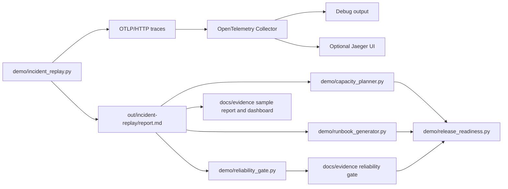

# Incident Replay And Reliability Gate Architecture

This lab turns the repository from static configuration into a repeatable
debugging and reliability-gate exercise. It replays AI inference traces for
normal traffic, cache-miss latency, dependency timeout, rollout regression, and
collector queue pressure scenarios, then evaluates whether the generated
signals match SRE expectations.



## Signals

Each replayed trace includes:

- `incident.scenario`
- `service.version`
- `ai.inference.latency_ms`
- `cache.result`
- `sre.signal`
- dependency child spans for cache, feature store, and model inference
- `telemetry.loss_rate`
- `collector.queue.pressure`

## Why This Matters

The key portfolio claim is not just "I configured OpenTelemetry." The stronger
claim is:

> I built a runnable lab that shows how an SRE or platform engineer can isolate
> AI inference incidents using trace context, Kubernetes metadata, collector
> delivery, incident narratives, configurable SLO gates, capacity sanity checks,
> and generated incident runbooks.

## Optional UI Path

If Docker is available:

```bash
docker compose up -d
python3 demo/incident_replay.py
open http://localhost:16686
```

Search for the `toy-ai-inference-api` service in Jaeger, then compare the
baseline and rollout regression traces.

## Committed Evidence

The lab also ships sample output generated by the replay:

- [Sample incident report](../evidence/sample-incident-report.md)
- [Sample summary JSON](../evidence/sample-summary.json)
- [Reliability gate report](../evidence/reliability-gate.md)
- [Reliability gate JSON](../evidence/reliability-gate.json)
- [Capacity plan](../evidence/capacity-plan.md)
- [Incident runbooks](../evidence/incident-runbooks.md)
- [Release readiness report](../evidence/release-readiness.md)
- [Incident replay dashboard](../evidence/incident-dashboard.svg)

## Kubernetes Smoke Path

For local Kubernetes proof, `scripts/kind-smoke.sh` applies the GKE-shaped
manifests, waits for the collector and workload, port-forwards OTLP/HTTP, runs
the replay, and evaluates the same reliability gate. See
[kind-e2e.md](../kind-e2e.md).
