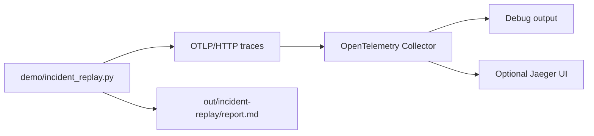

# Incident Replay Architecture

This lab turns the repository from static configuration into a repeatable
debugging exercise. It replays AI inference traces for normal traffic,
cache-miss latency, dependency timeout, and rollout regression scenarios.



## Signals

Each replayed trace includes:

- `incident.scenario`
- `service.version`
- `ai.inference.latency_ms`
- `cache.result`
- `sre.signal`
- dependency child spans for cache, feature store, and model inference

## Why This Matters

The key portfolio claim is not just "I configured OpenTelemetry." The stronger
claim is:

> I built a runnable lab that shows how an SRE or platform engineer can isolate
> AI inference incidents using trace context, Kubernetes metadata, collector
> delivery, and an incident narrative.

## Optional UI Path

If Docker is available:

```bash
docker compose up -d
python3 demo/incident_replay.py
open http://localhost:16686
```

Search for the `toy-ai-inference-api` service in Jaeger, then compare the
baseline and rollout regression traces.
